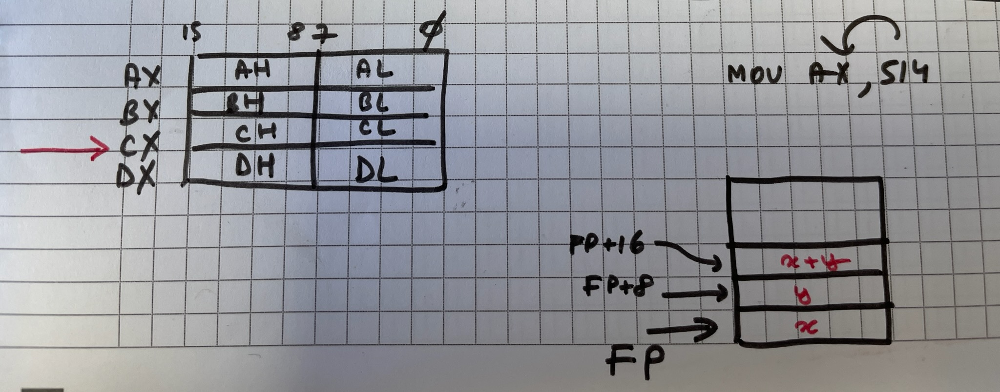

# asmAndGo


# asm1

function écrite en assembleur, appelée depuis le go
et qui calcule x+y en utilisant la pile et le registre AX



le pointer FP du i86 joue le role du pointeur SP en 8088/8086

pour linker et obtenir le fichier .o de façon isolé :

go tool asm asmadd.s

pour builder d'un coup go build dans le repertoire asm1

# asm2 

function myfact qui calcule une factorielle  en assembleur

(On doit pouvoir faire plus court, env 12 lignes ici....

Sur Ti-58 (1980) j'avais environ l'équivalent d'une quinzaine d'octets.

LBL A STO 01 1 STO 02 LBL A' RCL 01 PRD 02 DSZ 01 A' RCL 02 R/S

19 pas comme on disait à l'époque )


2 instructions CMPQ et JL testées dans la fonction mytest 

CMPQ    AX, valeur           // test si AX est < à la valeur 

JL      done                 // JUMP IF LESS


## Getting started

Les 2 principales syntaxes de l'assembleur aujourd'hui sont la syntaxe Intel et la syntaxe AT&T.
Ici c'est la syntaxe AT&T utilisée par le compilateur-assembleur GCC/GAS de GNU (Free Software Foundation)

Q indique une opération sur des cases mémoires de 64 bits, soit des mots quadruples (en anglais quad-word). 
EX : MOVQ, ADDQ du programme

ATTENTION sur le sens des opérations:

Avec la syntaxe AT&T, lorsqu'il y a 2 opérandes, la première représente la
source et la deuxième représente la destination.

OPERATEUR SOURCE, DESTINATION

EX : MOVQ $0, AX soit mettre la valeur zéro dans AX

Ca peut être perturbant quand  on sort du 8088 (comme moi) car c'est la  convention inverse en intel 8088/8086 !!!!

Voir https://fr.wikipedia.org/wiki/AT%26T_(assembleur)

## Add your files

- [ ] [Create](https://docs.gitlab.com/ee/user/project/repository/web_editor.html#create-a-file) or [upload](https://docs.gitlab.com/ee/user/project/repository/web_editor.html#upload-a-file) files
- [ ] [Add files using the command line](https://docs.gitlab.com/ee/gitlab-basics/add-file.html#add-a-file-using-the-command-line) or push an existing Git repository with the following command:

```
cd existing_repo
git remote add origin https://oogit.oodrive.net/architecture/asmandgo.git
git branch -M main
git push -uf origin main
```

